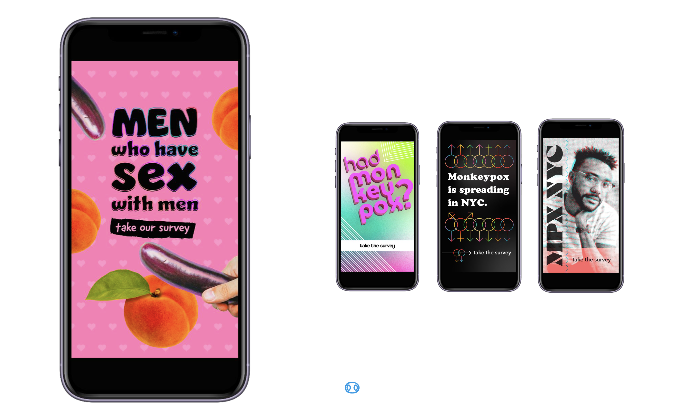

# Data collection {#sec-data}

```{r}
# Access custom defined functions
targets::tar_source("../R_functions")

```

{#fig-options}

## MPX NYC Person-Place Network Mapper

We designed, tested and implemented a survey tool we call the MPX NYC Person-Place Network Mapper. We named it this because the data collected through the instrument can be naturally organized into a bipartite network with nodes representing people and places, and edges representing relations between people and places. Organizing the data as a network allows the interpretation of network parameters such as node degree or connectedness as descriptors of the system connecting people to each other through the places they traverse within the city.

We designed the tool to solve practical and ethical issues related to the collection of sensitive spatial data in the context of an annonymous survey. Practically, we were interested in collecting data on locations participants visited and possibly had group sex in, but understood that we would not collect useful data if we collected markers like address or sip code using usual survey methods. In addition, we had hypothesized that a sizable proportion of sexual contact in a group happens in private settings whose addresses and exact locations participants were likely to forget.

Ethically, we were aimed to collect a data set that would limit the risk of identifying survey participants through the locations and other data disclosed through the survey. Collecting spatial coordinates would increase the risk of accidentally identifying people by, for instance, capturing the exact coordinate of a college dormitory as a participant's residence, or capturing the exact coordinates of a federal government office as a venue for sexual contact in a group setting. In both these examples, it becomes easier to narrow down the identity of participants using the location and the particiapnts' characteristics as recorded in survey data.

### MPX NYC Person-Place Network Map

Though the investigator team doubted that participants would remember addresses or zip codes of places they visited, we thought that they might remember landmarks, cross-streets, neighborhood names, subway stations names, and other markers New Yorkers use to navigate the city so we used the Google maps interface and API.

{#fig-mapinputformat}

The MPX NYC Person-Place Network Map question displays a map with detailed geographic information including place names, roads, and neighborhood names. It includes a search bar as well as other navigation tools usually found on a google maps display (see @fig-mapinputformat).

To collect anonymous information on locations, first the participant is prompted to identify places of a certain type by tapping on the map. For instance, the first Network Map question asks participants to identify their primary residence. Once they select one, they are able to move onto the next question.

The Network Map also allows researchers to elicit a collection of locations. For instance, we ask participants to identify all the places they have had physical or sexual contact in a group setting. Each time the participant taps the map, a marker appears where they tapped, and a pop-up window asks questions about the most recently identified location. In our study, participants were asked if they had sexual contact at the location and to select the type of location it is from a closed list of options.

### Coarsening to census tract

To ensure participant anonymity, the survey tool coarsens spatial data to the census tract level before sending them to the study database. Census tracts are non-overlapping spatial units that partition the United States into areas ranging from $2500$ to $8000$ in population size [@uscensus2022]. This is done through The Federal Communications Commission API [@fcc2022] which receives longitude-latitude coordinates from the survey instrument, and returns census block identifiers, which are transformed to census tract identifiers by truncating the last X digits. \[CITATION\] It is only after spatial data are transformed that they are transmitted to the study database (backend).

### Development

The front end of the MPX NYC Person-Place Network Mapper was developed as a single-page web application using the React/NextJS framework [@vercel2024] with visual design based on the MPX NYC style guide. The back end was a custom-built neo4j graph database [@neo4j2024]. Along with the Network Map question format, the instrument allows the use of standard survey question formats (multiple choice, single choice, text field etc.).

### Testing

The MPC NYC Person-Place Network Mapper underwent two rounds of user testing. About 10 people participated each time, returning feedback via an informal feedback questionnaire and via email.

## MPX NYC marketing and communication

To maximize the speed of recruitment, we invested in a bilingual, culturally competent communication campaign in collaboration with a marketing agency. The brief was to create a name and marketing concept that convey scientific rigor, build trust with the community, and stand out in a crowded online marketplace (see @fig-requirements). As a starting point, the RESPND-MI team suggested a campaign that playfully uses emojis that have sexual connotations in queer and trans communities, and that integrates LGBT social media influencers as a communication channel.


Two campaign names and four marketing concepts (see @fig-options) were developed by the marketing agency and presented to a meeting of the RESPND-MI Community Forum. The final concept and name were decided by consensus during that meeting.

Marketing materials were developed based on the concept. Materials included graphics, videos by queer influencers, and a style guide (including colors, icons, and fonts) for all public-facing materials of the MPX NYC study. We organized these materials into a "social media toolkit" and shared them through the study website to enable individuals and organizations to easily share them through their own social media accounts.

Participants were recruited via paid and donated advertising placed through Grindr, Twitter, Instagram, and outdoor electronic billboards.

## Consent and ethical approval

Prospective participants read and responded to a consent statement before being able to take the survey. The study, including marketing materials and software, was reviewed and approved by the T.H. Chan School of Public Health Institutional Review Board (IRB22-0761).

Consent to participate in the study will be obtained through the online survey platform. Once participants agree to consent, survey questions will be administered automatically.

After presenting each participant with information on the study, the first question in the online survey instrument will ask if they consent to participate. If they do not consent they will exit the survey. If they do consent, they will proceed with the survey. Their response will be recorded in study data.

## Participants and setting

Potential participants were included in the study if they consented to participate, were over 18 years of age, identified as transgender, gay, bisexual, or as men who have sex with other men, and were in New York City in the four weeks preceding their participation. Potential participants were excluded if they were younger than 18 years of age or they withdrew consent.

## Translation

All study materials were professionally translated from English to Spanish. The translation was reviewed by six professionals in health-related fields whose primary language is Spanish.

## Additional

This custom web application will be designed by a web developer. In accordance with guidance from Harvard IT services, we will ensure that the app collects only the data approved by the IRB.

```{r}
#| fig-width: 2
#| fig-height: 2
#| fig-align: center


plot_icon(icon_name = "devil", color = "dark_orange", shape = 16, alpha = 0.1)

```
