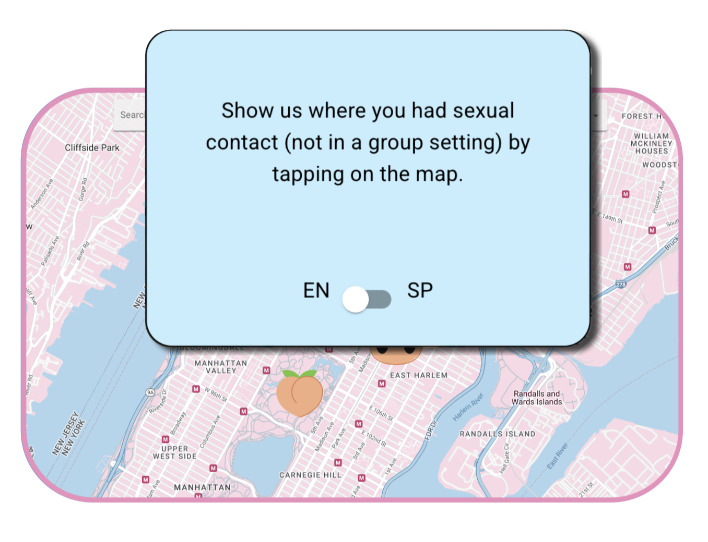
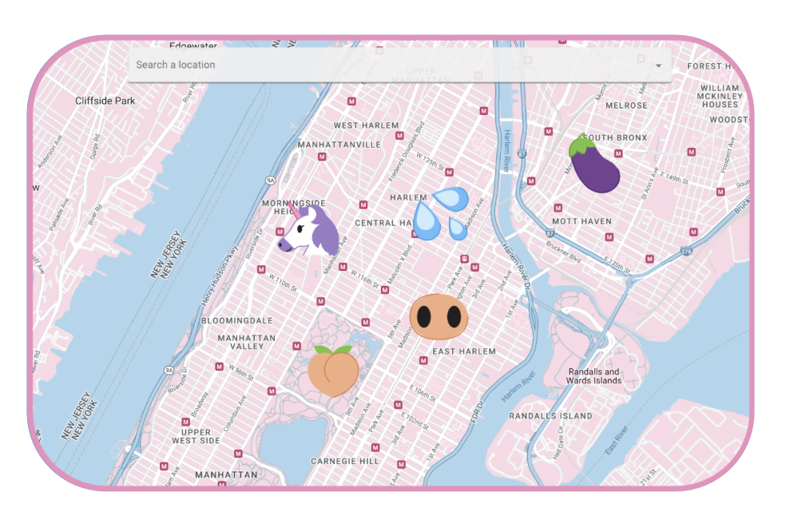
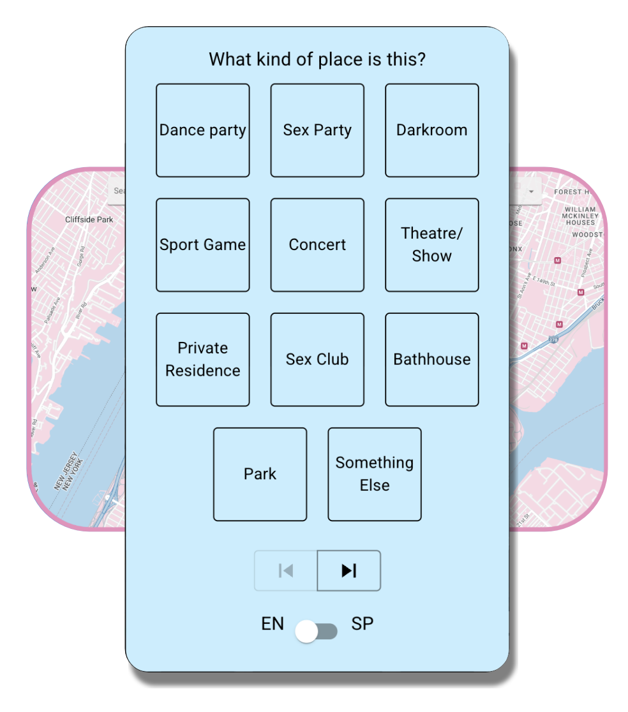
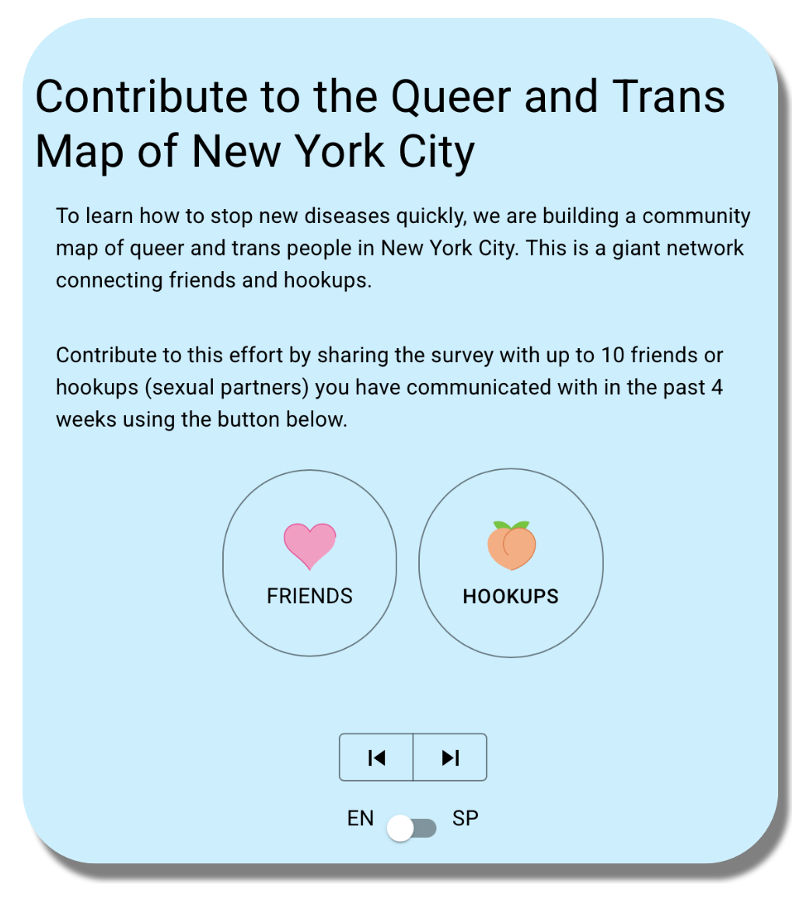
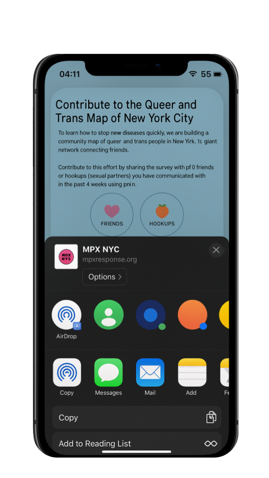

# Data {#sec-data}

```{r  include=FALSE}
targets::tar_source("R_functions")
```


##  {.unnumbered}

We did an annonymous, online, cross-sectional study in New York City from August to November of 2022. To be eligible for participation, individuals had to be at least 18 years old, living in or recently present in New York City, and identify as transgender, gay, bisexual, queer, or as men who have sex with men. Individuals younger than 18 or who declined consent were excluded.

## Marketing and communication

To support recruitment, we developed a bilingual, community-centered communication campaign in collaboration with a marketing agency. The campaign was guided by the RESPND-MI LGBTQ+ Community Forum, which emphasized visual language rooted in queer and trans culture—emojis with sexual connotations, humor, and peer-to-peer tone. The Community Forum was an open, participatory call connecting more than eighty researchers, clinicians, community organizers, mpox patients, influencers, and party promoters who came together to coordinate efforts to respond to mpox. Members of the Community Forum voted on a creative direction for the recruitment campaign and on the name of the study (see @fig-options). 



Paid and donated advertising was distributed through Grindr, Twitter (X), Instagram, and outdoor digital billboards across New York City. The campaign’s creative concepts combined scientific credibility with cultural familiarity, fostering trust and broad participation while maintaining visual distinctiveness in a crowded media environment.


## MPX NYC Person–Place Network Mapper

Data were collected using the [MPX NYC Person–Place Network Mapper](https://survey-instrument.vercel.app){target="blank"}, a web survey tool designed to elicit sensitive spatial and social data anonymously.

{fig-align="center" width="492"}

The Mapper displayed an interactive city map where participants identified key places—such as homes, parties, or social venues—by tapping on the map.

{fig-align="center" width="492"}

Each tap generated a marker and a short sequence of questions about that location.

{fig-align="center" width="492"}

To preserve confidentiality, the survey instrument automatically transformed geographic coordinates into U.S. Census Tract identifiers before transmission. These tracts, which partition the United States into units of roughly 2,500–8,000 residents, ensured that no identifying spatial data entered the study database.

Spatial data were originally collected at the census tract level but aggregated to community districts for analysis. Community districts divide New York City into administrative areas nested within its five boroughs and each nesting census tracts.


## MPX NYC Link Tracer

In addition to the Person–Place Network Mapper, we implemented a Link Tracer feature designed to support anonymous chain-referral recruitment. Participants were invited to share a pre-written message (with unique survey link) with recent friends or sexual partners.

{fig-align="center" width="492"}

Messages would be shared via the participant's device's native "share sheet". This design ensured that the study platform never accessed or stored phone numbers, email addresses, usernames, or any other identifying information.

{fig-align="center" width="300"}

Uptake was low: fewer than 10 people used the referral feature during the study period. Because such a small number could not support meaningful analysis, we discarded these data. No link-tracing information is included in the analytic dataset.


## Study implementation


### Translation {.unnumbered}

All study materials were professionally translated from English to Spanish and reviewed by six bilingual professionals in health‑related fields whose first language is Spanish. This ensured linguistic accuracy and cultural appropriateness across recruitment, consent, and survey materials.

### Consent and Ethical Approval {.unnumbered}

Participants provided informed consent electronically before beginning the survey. The study protocol—including recruitment materials, web application, and all data‑collection procedures—was reviewed and approved by the *Harvard T.H. Chan School of Public Health Institutional Review Board* (IRB22‑0761).

To maintain participant privacy:

-   No identifying information—such as names, phone numbers, email addresses, IP addresses, or contact lists—was collected at any stage.

-   To support data integrity while preserving anonymity, each participant was assigned two independent unique identifiers (a public and a private ID). The encrypted cross-walk linking these identifiers was stored in a separate, access-restricted database.

-   All study data were maintained on a secure, credential-protected server, with access limited to authorized research staff.

-   To ensure completeness and protocol fidelity, the study team conducted routine data-quality monitoring, including daily checks of consent flow and survey logic, and weekly reviews of recruitment patterns and instrument performance.

This design enabled the rapid construction of a large, richly structured social–spatial dataset while minimizing risk and upholding the highest standards of participant confidentiality.

## Data: MPX NYC Participant–Community Network

The resulting dataset represents a bipartite person–place data graph, where people and places are nodes and their reported connections (residence, social contact, or sexual contact) form edges. The graph is bipartite since the only edges are between one person and one place. We call it a data graph since each person node is associated with a record in the study data. This graph structure defines the analytic foundation for SSNAC, supporting causal reasoning under network interference.




