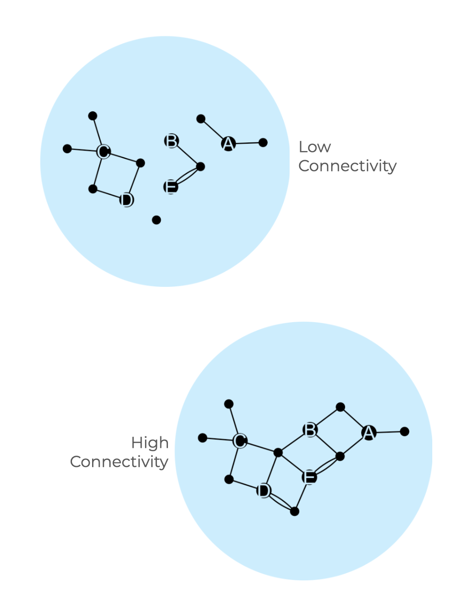
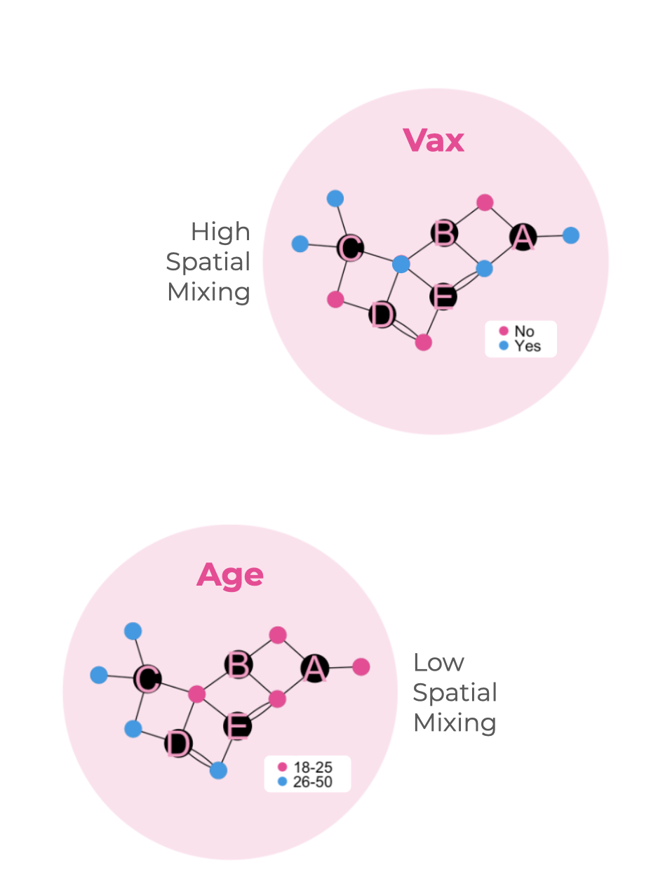

# Measures {#sec-measures}

```{r  include=FALSE}
targets::tar_source("R_functions")
```

## Data: MPX NYC Participant–Community Network

The MPX NYC Participant–Community Network links individuals in the study to the community districts of New York City. In this bipartite network, nodes represent either individual participants or community districts, and a tie between an individual and a community district indicates either residence or attendance at a gathering in that district.



Spatial data were originally collected at the census tract level but aggregated to community districts for analysis. Community districts divide New York City into administrative areas nested within its five boroughs and each nesting census tracts.

## Node Characteristics

We collected detailed information on participants’ demographics, health, and patterns of social and sexual connection.

<u>Demographic measures</u> included age, race, sex assigned at birth, gender identity, sexual orientation, and community district of residence.

<u>Health-related measures</u> covered HIV status, viral suppression, STI-related symptoms, use of pre-exposure prophylaxis (PrEP), and mpox vaccination status.

<u>Connection measures</u> captured each participant’s degree of engagement within queer and transgender communities, including counts of recent individual sexual contacts, recent individual physical (non-sexual) contacts, important social contacts, and including whether the participant reported recent physical or sexual contact in a group setting.

<u>Gender modality</u> : Gender modality was measured using a two-step approach. Participants were first asked to indicate their current gender (options: man, woman, trans man, trans woman, non-binary, or other) and then their sex assigned at birth (male, female, or other). @tbl-gendermodality summarizes how gender modality was derived by combining these responses.



<u>Race–Gender</u> : Starting with the gender modality variable, we created a race–gender variable by dividing cisgender men into white cisgender men, Latinx cisgender men, Black cisgender men, and Other cisgender men—the latter combining Asian, Pacific Islander, and other racial identities.

<u>Social Catchment</u>: Social reach is defined as the number of edges connected to a particular community district in the MPX NYC Person-place graph. It reflects the overall level of participant contact associated with a given district. (*For example in @fig-example-person-place-network, Community District B has a social reach of three, since it has one connection each with participants 2, 3, and 4.*)

<u>Spatial Catchment</u>: Spatial reach is defined as the number of paths connecting a given community district to other community districts. It represents the geographic centrality of a community district. (*For example in @fig-example-person-place-network, Community District C has a spatial reach of five, since it there are four posible paths connecting C with D and there is one path connecting C with E.*)

## Edge Characteristics

Each participant reported the location of their residence. Additionally, those who reported recent physical or sexual contact in a group setting reported the locations where that contact happened. Each residence or gathering is represented as an edge linking a participant to the community district containing the residence or gathering. Each edge was associated with the following characteristics:

<u>Edge type</u> : Each edge was categorized as either a *residence* edge or a *gathering* edge.

<u>Gathering type</u> : Response options included *dance party, sex party, darkroom, sports event, concert, theatre or show, private residence, sex club, bathhouse, park,* or *another type of event*. This variable is null for residence edges.

<u>Sexual Contact</u> : Response options included *yes* — indicating that sexual contact occurred at a given gathering — or *no*. This variable is null for residence edges.

<u>Distance from home</u> : We constructed an approximate measure of distance from home to each gathering. This variable is null for residence edges. Distances fell into the categories: same community district as the participant’s residence; different community district but within the same borough; or different borough entirely.

## Network Characteristics

[Size of the Largest Connected Component]{.underline} : In the MPX NYC Participant Network, overall connectedness was measured using the largest connected component (LCC)—the subset of nodes in which every participant can be reached from every other participant through one or more existing network ties. The proportion of all nodes contained in the LCC serves as a measure of how cohesively the network is connected: a larger LCC indicates greater overall connectedness among participants.


{fig-align="center" width="400"}

[Spatial Mixing Ratio]{.underline} : We assessed spatial patterns of interaction between distinct subgroups of participants using the spatial mixing ratio. This measure quantifies the extent to which individuals from one group tend to live or gather in the same community districts as individuals from another group.

{fig-align="center" width="400"}


Formally, the spatial mixing ratio is a positive real number greater than 1 when members of the first subgroup are more likely than random to share community districts with members of the second subgroup, and between 0 and 1 otherwise. It is calculated as the average (across all individuals) of each person’s spatial preference for the second group divided by the second group’s overall prevalence in the sample. Preference is defined as the number of connections to individuals of the second subgroup as a proportion of total number of connections.
