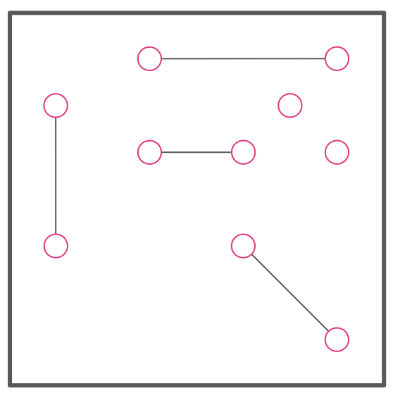
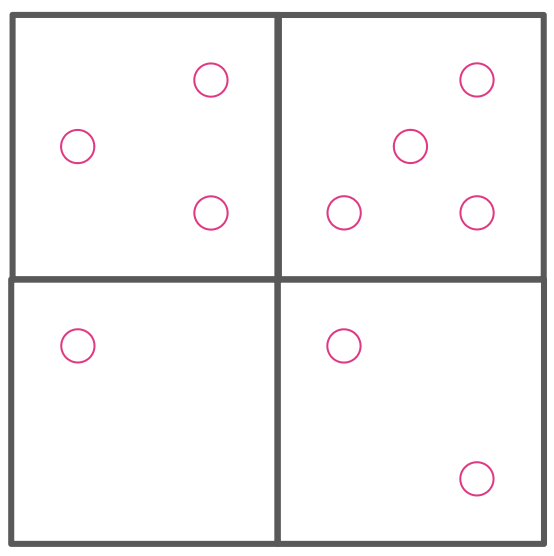
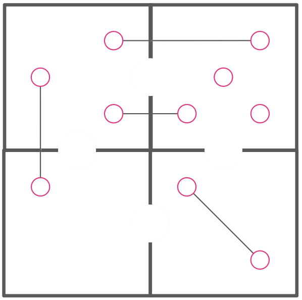
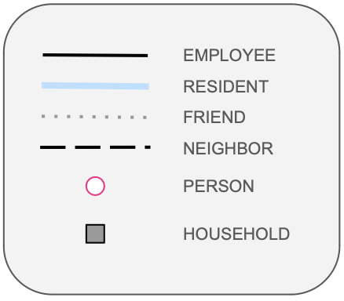

# Introducing SNACC

```{r}
# Access custom defined functions
targets::tar_source(files = paste0(here::here(), "/R_functions"))
```

We give a preliminary outline for a framework for organizing and analyzing network data along with spatial data. This framework emerges from a few years of trial and error with epidemiologic analyses of network and spatial data. The Social Spatial Network Analysis with Causal interpretation framework is an approach to incorporating social and spatial context in causal analyses of individual-level epidemiologic data. It explicitly accounts for measured relationships among people, among places, and between people and places.

### Spatial and social context

To motivate the framework, we consider a study investigating the risk of acquiring a cold among individuals (pictured as dots in physical space in each frame of @fig-context) in a setting where there is one known infected person. The simplest approach would be to assign average risk of acquiring a cold to each individuals. The problem with this strategy, though, would be that not all individuals have the same risk once we know who the infected person is. Those who are more likely to interact closely with them have higher risk, but not all people are equally likely to interact.

::: {#fig-context}
::: {layout-nrow="1"}








:::

Approaches to incorporating context in studies of individual health
:::

A social network analysis would gain a more granular understanding of risk by assigning people who are connected to other people a higher risk of acquiring the cold than those who have no relationships. In addition, different connected components of the network could be assigned differnet levels of risk.

An ecologic approach would be to divide up the area into households and assign a different level of risk based on the household (third panel from left). If we knew who has a cold, we could assign people in the same household higher risk for acquiring the cold than others. This anlysis, however, would ignore the fact that households are not equally connected.

A spatial analysis would enhance this analysis by enriching household data with a spatial weights matrix indicating which pairs of households are neighrbors (second panel from right). Then the risk of aquiring a cold in a given household would be a function of the risk of aquiring a cold among individuals in neighboring households.

An SSNAC analysis (rightmost panel) would take advantage of both spatial and social network data, assigning risk so that the risk of acquiring the cold is a function of the household the individual belongs to, the neighboring household, and the social network connections.

### The Person-Place graph

The central data structure in a SSNAC is the person-place graph. @fig-ssnac depicts the rightmost frame of @fig-context by showing spatial units as nodes in a network, connecting adjacent spatial units with a network edge, and connecting individuals with the households they belong to. To show the flexibility of this data object, we added an additional type of relationship an individual can have with a household - that of an employee.

The majority of study data are stored as node or edge attributes. For instance, person nodes might have attributes like age and race whereas place nodes could have attributes like density or surface area. An edge linking a person to a place might have an attribute conveying how the person relates to the place. For instance in @fig-ssnac, some edges indicate residence, some indicate next-door-ness, and some indicate employment.

::: {#fig-ssnac}
::: {layout="[3,1]"}



:::

SSNAC Person-place graph
:::

### New causal queries

Drawing on the core methods in Makofane's doctoral dissertation on material resources, family networks, and health in Agincourt, South Africa, we articulate a framework through which to understand and evaluate causal queries. These methods applied the auto-g-computation methods.

In brief, we define an n-dimensional counterfactual (where n is the number of treatment units whose outcome is of interest), and an n-dimensional treatment vector. The causal quantity of interest can be calculated as a function of these vectors as well as the structure of the person-place network.

There are four types of causal queries in the SNACC framework.

-   Person-To-Place: Evaluating the causal impact of a person-level intervention on place-level outcomes for some defined set of people and some defined set of places. e.g. What is the impact of vaccinating college-aged adults in New York City on mpox incidence in Union Square (a favourite hangout spot for college students)

-   Person-to-Person: Evaluating the impact of a person-level intervention on person-level outcomes for some defined sets of people. e.g. How does vaccinating all cisgender white men in New York City affect mpox incidence among Black and Latinx cisgender black men in New York City?

-   Place-to-Place: Evaluating the impact of a place-level intervention on place-level outcomes for some defined sets of places. e.g How does vaccinating Manhattan affect mpox incidence in Brooklyn?

-   Place-to-Person: Evaluating the impact of a place-level intervention on person-level outcomes for some defined set of people and some defined set of places. e.g. How does vaccinating Harlem affect mpox incidence among cisgender black men in New York City

In each query, we can calculate an average total effect as we do usually:

In addition, we can calculate and average direct effect, which captures the portion of the causal effect attributable to causal pathways that stay within the individual and a portion attributable to causal pathways that are disseminated across nodes in the network. The average direct effect is given by:

And the average spillover effect is given by:

### SSNAC definition

A SSNAC is -

At the minimum, a social and spatial network analysis with causal interpretation should include an explicit statement of:

-   what types of observational unit nodes represent

-   what types of ties exist in the network

-   rules about allowable edges

-   the counterfactual contrast

-   theory defining:

    -   meaning of nodes,

    -   meaning of edges

    -   description of spreading process (if necessary)

### Sociological theory

It is crucial in a SSNAC to be clear about the theory that allows the researcher to depict the situation under study as a person-place network, and that will be used to interpret any results obtained. In particular, it is important to clearly state the research question under investigation before defining nodes and edges. For instance, if we were studying the spread of gossip, we might decide that the only edges which are important for transmission of gossip are friend ties and resident ties. In this case, we would be asserting a theory of causation which states that in this setting, people do not gossip with their neighbors, but do gossip with their friends and with their household members. This is different from the theory under use in an infectious disease investigation in the same setting. In this case, assuming that friends, neighbors, and household members all spend time in confined spaces, all the edges are important to account for in analyzing the transmission of airborne disease.
