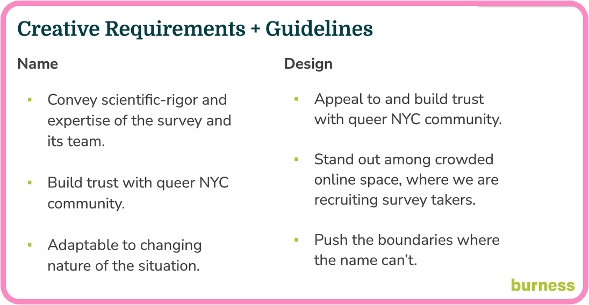

# MPX NYC II: Marketing {#sec-data}

```{r  include=FALSE}
targets::tar_source("../R_functions")

```

::: {#authors}
Keletso Makofane, PhD

RESPND-MI Collaboration
:::

## MPX NYC marketing and communication

{#fig-options}

To maximize the speed of recruitment, we invested in a bilingual, culturally competent communication campaign in collaboration with a marketing agency. The brief was to create a name and marketing concept that convey scientific rigor, build trust with the community, and stand out in a crowded online marketplace (see @fig-requirements). As a starting point, the RESPND-MI team suggested a campaign that playfully uses emojis that have sexual connotations in queer and trans communities, and that integrates LGBT social media influencers as a communication channel.




The RESPND-MI study team approached marketing not as a top-down broadcast but as a community-driven endeavor. From the very beginning, we partnered closely with the RESPND-MI LGBTQ+ Community Forum (CF) to workshop language, imagery, and channel preferences. We partnered with a marketing agency to, asking them to name the campaing and provide a marketing concept. Two campaign names and four marketing concepts (see @fig-options) were developed by the marketing agency and presented to a meeting of the CF. The final concept and name were decided by consensus during that meeting.


Focus-group feedback shaped both the voice and visual style of our materials, ensuring they read not like clinical advisories but as messages “of us, by us.” This co-creation process helped us land on the right balance of urgency and relatability and guided decisions about everything from color palettes to tone, emoji use, and even the inclusion of playful vernacular. 

We developed a suite of branded assets in a social media toolkit: digital graphics, animated GIFs, flyers, and social-media posts. These assets used vibrant hues, harm-reduction tips, and emojis — symbols that queer and trans people often use to communicate about sex — to frame health education and participation in the survey as both essential and empowering. 

To maximize reach and resonance, we layered in both influencer amplification and strategically targeted placements. Short, scripted mpox-education videos were produced on Cameo by celebrity personalities familiar to queer audiences—ranging from reality-TV stars to drag queens to Broadway actors. We distributed the videos on social media on the RESPND-MI website and newsletter. Concurrently, we secured out-of-home placements on high-foot-traffic venues (such as Fire Island ferry terminals and LinkNYC kiosks) and in-app slots on Grindr, a popular dating platform. Notably, Grindr provided the RESPND-MI study team with pro bono ad space to recruit participants. Because New York’s queer and trans communities are linguistically diverse, every piece of collateral was produced in both English and Spanish. 

In addition, we placed “Six Ways We Can Have Safer Sex in the Time of Monkeypox,” a list of harm-reduction tips, in POZ Magazine. With support from UCLA Luskin School of Public Affairs, we translated those six harm-reduction tips into graphics for social media. Mass media, such as The Los Angeles Times and Last Week Tonight with John Oliver, amplified the harm-reduction tips in their publications, further extending our reach. 

By combining community-led design, professional creative execution, influencer storytelling, targeted media buys, and bilingual harm-reduction messaging, the RESPND-MI marketing approach exemplified how culturally attuned public health communication can drive both engagement and impact.


```{r}
#| fig-width: 2
#| fig-height: 2
#| fig-align: center


plot_icon(icon_name = "devil", color = "dark_orange", shape = 16, alpha = 0.1)

```
