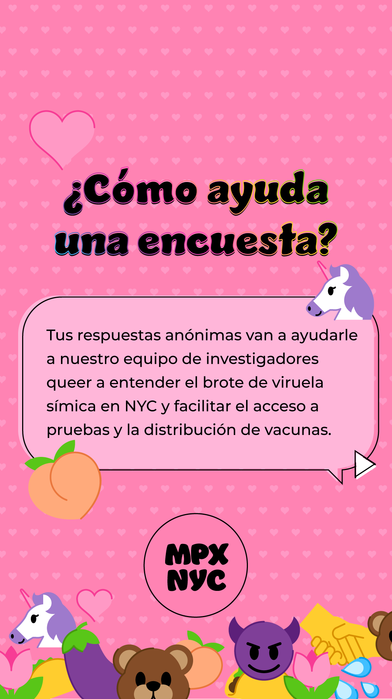
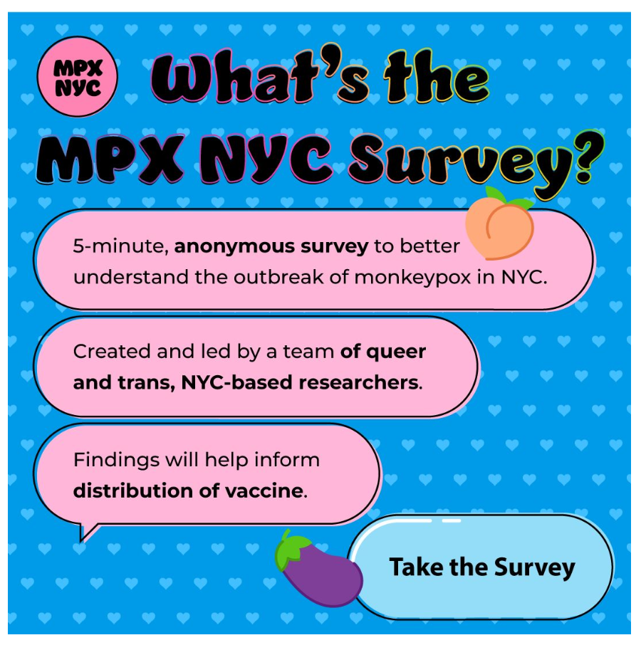

# MPX NYC Marketing {#sec-marketing}

```{r  include=FALSE}
targets::tar_source("../R_functions")

```

### Community-driven communication {.unnumbered}

To support rapid recruitment, we developed a bilingual, culturally grounded communication campaign in collaboration with a marketing agency. The aim was to create a name and concept that combined scientific credibility with familiarity and trust. The brief called for a campaign that could stand out in a crowded visual field while speaking directly to queer and trans audiences.

{fig-align="center" width="314"}

The RESPND-MI team proposed starting with a visual language rooted in community—using emojis with sexual connotations familiar in queer and trans spaces, and partnering with LGBTQ+ influencers who could communicate from within those networks rather than from above.

### Co-creation and consensus {.unnumbered}

From the outset, marketing was treated as a collaborative process. The RESPND-MI LGBTQ+ Community Forum (CF) became the space where language, imagery, and outreach channels were workshopped in real time. The marketing agency developed two campaign names and four visual concepts. The CF reviewed and debated these options, ultimately reaching consensus on the final direction.

Feedback from forum members informed every detail of the campaign’s tone and design—from color palettes to emoji use to the balance between urgency and humor. The result was messaging that felt conversational and community-driven, not institutional.

{#fig-options}

### Voice, visuals, and reach {.unnumbered}

The final campaign combined a clear visual identity with adaptable materials. We produced digital graphics, GIFs, flyers, and social-media posts that framed participation and harm reduction as acts of mutual care. All materials were made available in English and Spanish to reach linguistically diverse audiences.

{fig-align="center" width="363"}

Influencer and media partnerships extended the campaign’s reach. Short, scripted mpox-education videos were produced on Cameo with queer performers and community figures and shared on social media, the RESPND-MI website, and newsletter. Out-of-home materials were displayed in high-traffic queer spaces such as Fire Island ferry terminals and LinkNYC kiosks, and Grindr donated in-app ad space to support recruitment.

We also published *Six Ways We Can Have Safer Sex in the Time of Monkeypox* in *POZ Magazine*, later adapted into shareable graphics in partnership with UCLA Luskin School of Public Affairs. Major outlets, including *The Los Angeles Times* and *Last Week Tonight with John Oliver*, amplified the message, helping extend its reach beyond local networks.

### Reflection {.unnumbered}

The campaign’s process demonstrated that collaborative, culturally attuned communication can operate effectively under emergency conditions. Through shared decision-making and bilingual, community-led design, the RESPND-MI team aligned scientific goals with community values and produced materials that were both practical and widely trusted.

###  {.unnumbered}

::: {.callout-note icon="false" appearence="simple"}
# Key outputs

Bilingual **social media toolkit** with digital graphics, GIFs, and flyers. Short mpox - **education videos** by queer public figures. **Out-of-home placements** at high-traffic LGBTQ+ venues. Pro bono in-app **ads on Grindr**. **Bilingual harm-reduction materials** featured in *POZ Magazine* and adapted for social media.
:::


```{r}
#| fig-width: 2
#| fig-height: 2
#| fig-align: center


plot_icon(icon_name = "devil", color = "dark_orange", shape = 16, alpha = 0.1)

```
