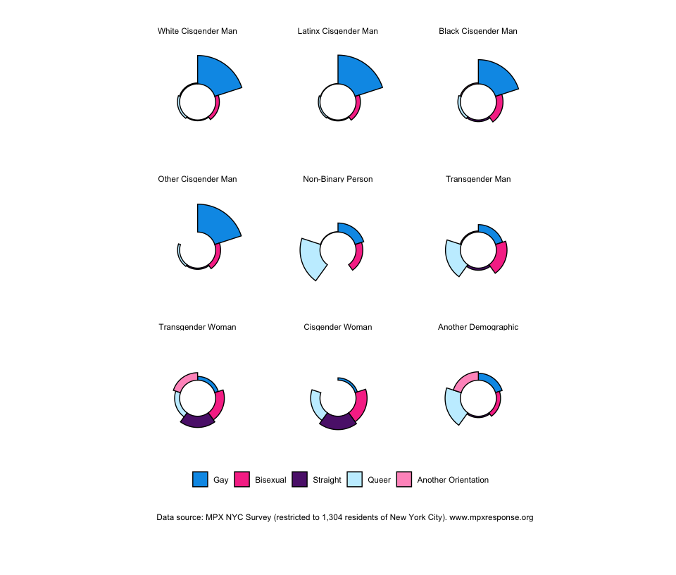
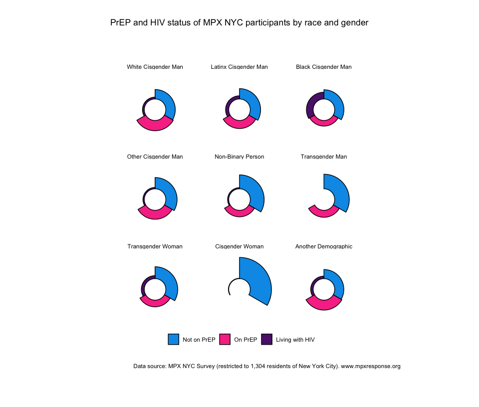
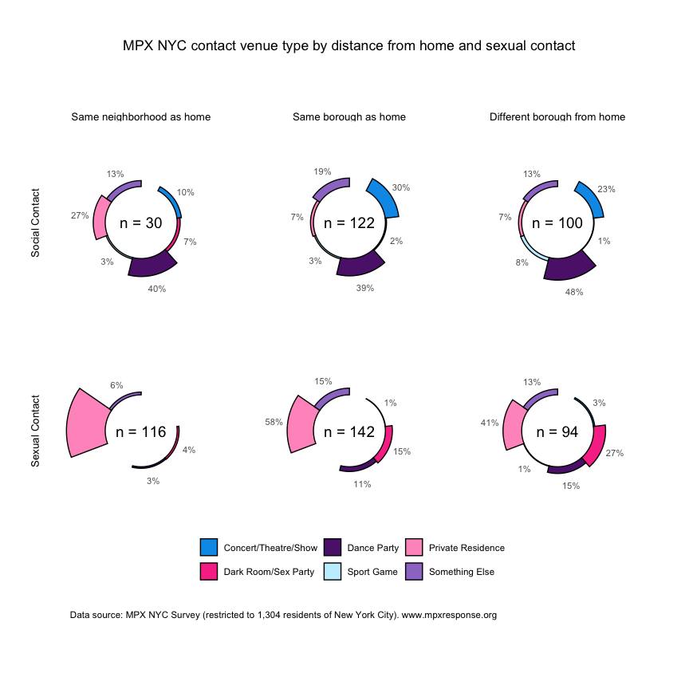
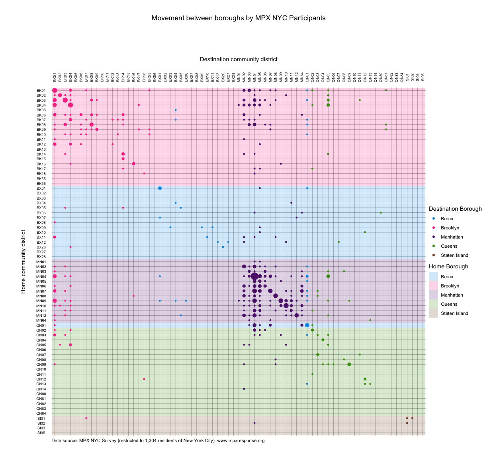
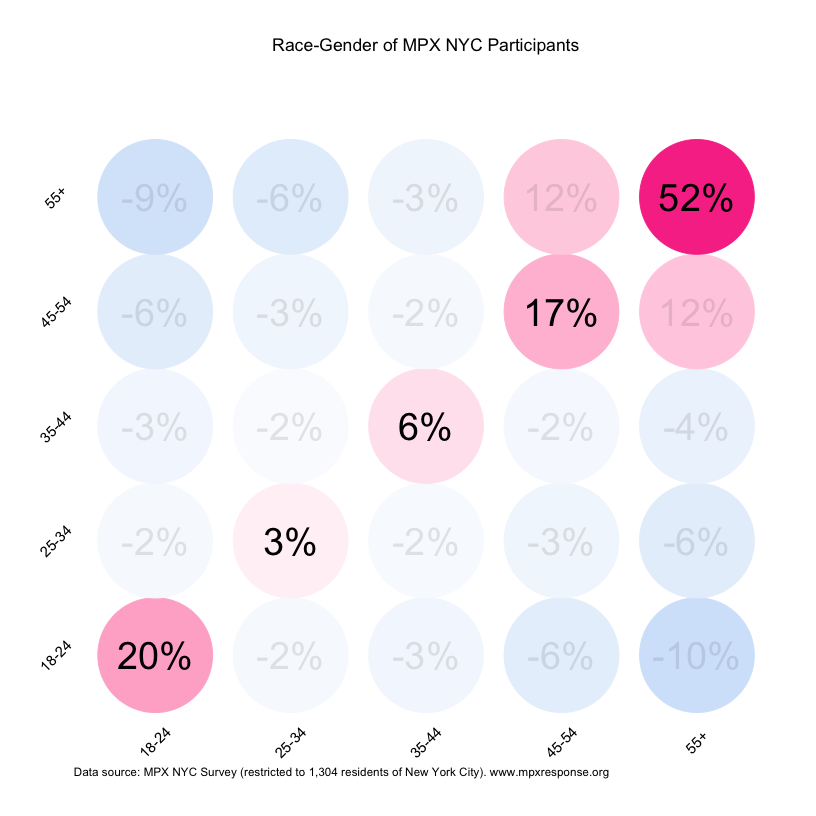
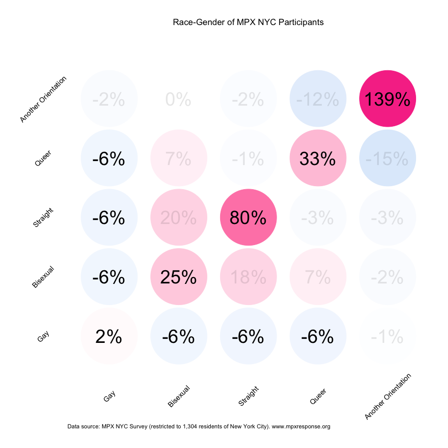
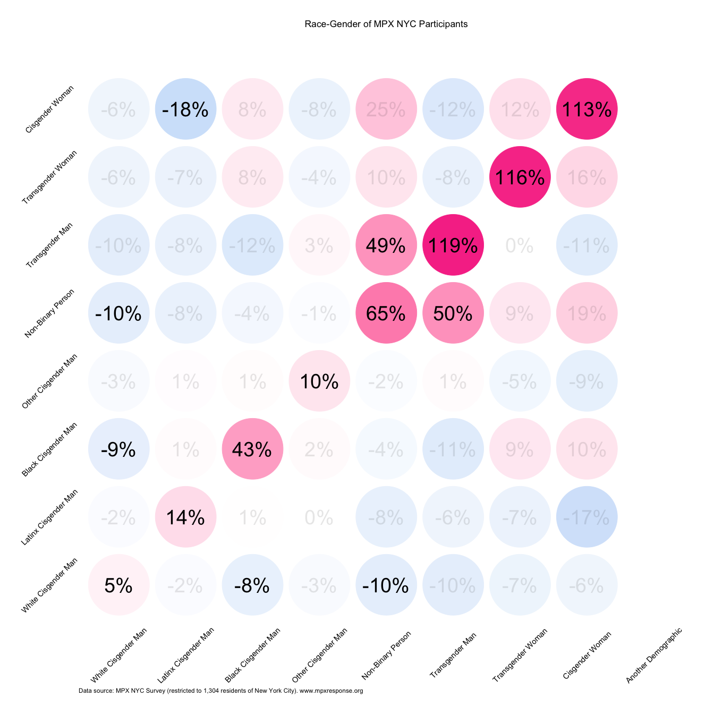
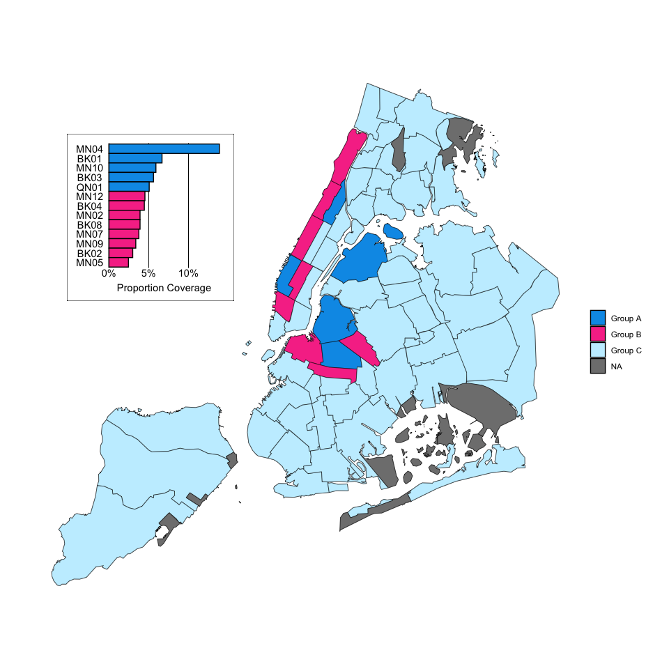
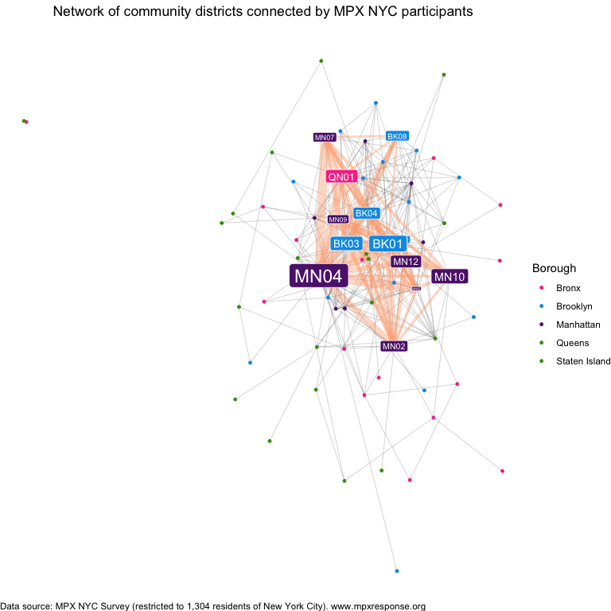
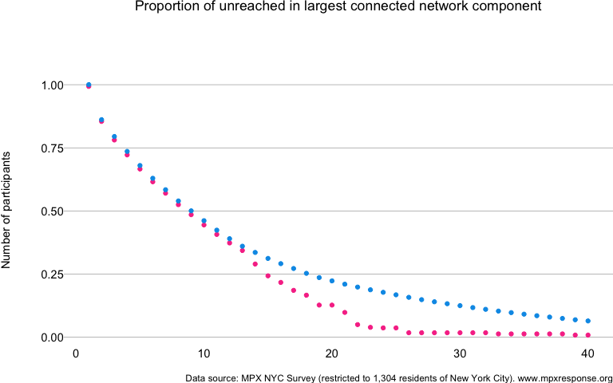

= MPX NYC
Keletso Makofane
2024-05-23
:stem: latexmath

== Methods

=== Data Collection

As part of The Rapid Epidemiologic Study of Prevalence, Networks, and Demographics of Monkeypox Infection (RESPND-MI), we implemented a brief, anonymous, online survey. Data were collected from 20 August 2022 to 15 November 2022 among transgender people and gay, bisexual, and other men who have sex with men in New York City.

==== RESPND-MI Community Forum

To tap into the practice-based knowledge held by queer and trans organizations individuals and organizations who do health-related work, and to ensure that we were not duplicating efforts, we planned a rapid consultation meeting at the outset of the project. Investigators compiled a list of 53 stakeholders in New York City (TYPE A, TYPE B TYPE C). To maximize participation, where possible, these individuals were invited via email by investigators with whom they had a prior relationship.

The consultation meeting on 27 June 2022 was attended by XX people from XX organizations (LIST THEM). We had an epidemiologist summarize what they knew about the outbreak, invite others to share what they knew, and talked about our intention to run a study, inviting participants to join the study as investigators. At that meeting, participants requested that the RESPND-MI team host a weekly meeting (since there were no similar fora dedicated to mpox at the time) for the purpose of sharing epidemiology and research about mpox and understand how different organizations are experiencing mpox among their clients and communities.

We named the space the RESPND-MI Queer and Trans Community Forum and held it weekly from June to August 2022 (About 80 people participated). Though the main purpose was to share information and allow organizations and individuals to coordinate political action (CITE PLOS GLOBAL), we also used the meeting to consult about specific study-related decisions.

==== Recruitment

We collaborated with a marketing agency to develop and conduct a study recruitment and health information campaign in English and Spanish. Our brief to the ageny was to create a name and visual identity that convey scientific rigor, build trust with the community we aimed to survey, and to stand out in a crowded online advertising space (see <<fig-requirements>>). As a starting point, we suggested a campaign that playfully communicates using emojis that are used to communicate about sex on online hookup platforms. Four marketing concepts (see <<fig-options>>) and two campaign names were developed by the marketing agency and presented to the RESPND-MI Community Forum. The final concept and name were decided by consensus.

.Requirements for MPX NYC Study
[#fig-requirements]
https://www.mpxresponse.org[image:images/clipboard-2397454480.png[images/clipboard-2397454480]]

Marketing materials included graphics for paid mobile ads, out-of-home ads, videos by paid queer influencers, and a style guide for all public-facing materials of the MPX NYC study (including colors, icons, and fonts). We organized these materials into a "`social media toolkit`" so that they would be easy for individuals and organizations to share through their own social media accounts. Advertisements were placed through Grindr, Twitter, Instagram, and electronic billboards.

[[fig-options]]
.Options for visual identity of MPX NYC 
image::images/clipboard-22126019.png["Options for visual identity of MPX NYC"]==== Data collection instrument

We designed and implemented a novel online survey instrument which captures detailed spatial information while maintaining anonymity. The look and feel of the data collection instrument was based on the MPX NYC style guide.

Along with standard question formats (multiple choice, single choice, and text field etc.) we developed a novel question format (which we call the map-input question format here) to elicit spatial information.

In map-input questions, participants are prompted to indicate all places of a particular type by tapping on a map (see <<fig-mapinputformat>>). Each time the user taps on the map, a marker appears and a pop-up window asks them to confirm the location. One confirmed, participants answer a series of questions related to that location. Once those are answered, the user is allowed to tap on the map again to indicate another location or to move on the next question.

[[fig-mapinputformat]]
.Map input question format developed for MPX NYC 
image::images/clipboard-1908474363.png[""]To protect anonymity, spatial data were saved as census tract identifiers rather than latitude-logitude coordinates. Census tracts are a spatial unit that exhaustively divides the united states up into areas ranging from XX to XXX in population size (CITE).

For each place that a user adds using the map-input question format, the Google maps API (CITE) returns the latitude and longitude to the user’s device. The coordinates are sent from the user’s device to the Federal Communications Commission API (https://geo.fcc.gov/api/census/) which returns the identifier for the census block containing the spatial coordinates. The census black identifier is transformed into a census tract identifier by truncating the last X digits (CITE), then it is transmitted to the study database. Data were stored in a custom-built graph database system hosted on a commercial cloud server platform. The instrument underwent two rounds of user testing before data collection.

==== Inclusion and Exclusion Criteria

Potential participants were included in the study if they consented to participate, were over 18 years of age, identified as transgender, gay, bisexual, or as men who have sex with other men, and were in New York City in the four weeks preceding the survey. Potential participants were excluded if they were younger than 18 years of age or they withdrew consent.

==== Translation

All study materials were professionally translated from English to Spanish. The translation was reviewed by six professionals in health-related fields whose primary language is Spanish.

==== Ethical Review

The study was reviewed and approved by the T.H. Chan School of Public Health Institutional Review Board (IRB22-0761).

=== Measures

==== Participants

The brief (5 minute) questionnaire was implemented in English and Spanish. It measured participant demographics, utilization of healthcare services (pre-exposure prophylaxis (PrEP), HIV treatment and vaccination against MPOX); connection to queer or transgender community (sex; socializing); and location of primary residence.

Gender identity was measured using a two-step approach: first, we solicited the participant’s current gender (man, woman, trans man, trans woman, non-binary, other), and then sex assigned at birth (male, female, other). Those whose gender identity and sex assigned at birth were not concordant were categorized as transgender. We used current gender to further categorize transgender people into men and women.

Race was measured using a multiple selection question based on census categories (White, Black, Latino/a/x, Asian, Pacific Islander, Other).

We defined gender-race subgroup as the combination of gender identity and race, collapsing small cells across racial group (White cisgender man, Latinx cisgender man, Black cisgender man, Other cisgender man, non-binary person, transgender man, transgender woman, cisgender woman, Another Demographic).

==== Residence and Contact venues

Using the map-input question format, we asked the location of participants’ primary residence. Among those who reported physical or sexual contact at a congregate setting in the preceding 4 weeks, we solicited the locations of the venues at which the contact happened. We refer to these locations as "`contact venues`".

For each contact venue (see <<fig-mapinputformat>>), participants indicated the type of place it was (Dance party, Sex Party, Darkroom, Sport Game, Concert, Theatre/Show, Private Residence, Sex Club, Bathhouse, Park, Something Else) and whether they had sexual or (non-sexual) physical contact there.

=== Statistical Analysis

==== Participant characteristics

Participant characteristics and contact venue characteristics were tabulated.

==== Contact venue characteristics

We tabulated contact venue characteristics by distance from home and by sexual contact. Census tract identifiers were converted into community district identifiers. Community districts are defined by the City of New York (CITAION). They nest census tracts.

We represented the distance from home to each contact venue using an ordinal variable with levels: same community district as home; different community district but same borough as home; different borough than home.

==== Spatial sorting and mixing

To understand how different demographic groups mix in physical space, we define the spacial selection coefficient of characteristic latexmath:[a\times2] for characteristic latexmath:[b]: a measure ranging from latexmath:[-1] to latexmath:[1] which is: - latexmath:[0] when subgroups latexmath:[a] and latexmath:[b] are perfectly mixed in space (i.e. knowing about where people with characteristic latexmath:[b] have contact venues, does not give you any information about where people with characteristic latexmath:[a] might have contact venues). - positive if contact venues for subgroup latexmath:[a] tend to be in the same community districts as those for subgroup latexmath:[b]. - negative if contact venues for subgroup latexmath:[a] tend to be in different community districts as those for subgroup latexmath:[b].

The spacial selection coefficient is defined as spacial selection ratio less 1. The numerator is the conditional probability of someone with characteristic latexmath:[a] sharing a community district with someone with characteristic latexmath:[b]. The denominator is the marginal probability of having characteristic latexmath:[b] in the population.

==== Hypothetical Intervention

We examined the efficiency and transmission impact of a hypothetical intervention to slow down the wide dissemination of a novel pathogen. The intervention a) lists community districts in decreasing order of popularity (in terms of residence and contact venues), b) immunizes all individuals who have a residence or contact place in the top district, c) removes all immunized individuals, and repeats these steps latexmath:[n-1] times or until everybody is immunized.

==== Efficiency

We examined intervention efficiency by plotting the proportion of immunized individuals vs number of vaccinated (latexmath:[n]) community districts. Because of spatial clustering, we would expect the first few community districts to contain more people than the last few districts in the list. i.e. for low latexmath:[n], the number of immunized individuals will grow faster than the number of community districts vaccinated as the hypothetical intervention unfolds.

This tendency will be reinforced by the removal of individuals in unvaccinated community districts who are associated with a community district that has already been vaccinated. In other words, vaccinating an individual in a particular community district (say the latexmath:[k^{th}] to be immunized) removes that individual from that district and any other districts they might have been vaccinated in later on (i.e. in the latexmath:[t^{th}] where latexmath:[t>k]).

==== Spatial network impact

To understand how the hypothetical intervention would affect transmission dynamics, we constructed a spatial overlap network. In this network, nodes are participants and weighted ties indicate that number of community districts shared by those participants (i.e. community districts where either of the participants has a residence or contact venue).

The density of this network represents (TRANSMISSION DYNAMICS).

Immunizing a community district removes all individuals associated with that community district from the network, possibly changing the structure of the network. Because individuals associated with a popular community district are likely to also be associated with some other community district than individuals who are not associated with any popular districts, we would expect the spatial overlap network to become less densely connected as an effect of vaccinating.

Transmission impact was examined by understanding the impact of removing community districts which have been vaccinated on the spatial overlap network.

==== Statistical Inference

We used the non-parametric bootstrap to calculate point estimates and 95% confidence intervals (CI). Participants were re-sampled with replacement 100 times. For each measure, the lower and upper bound of confidence intervals were calculated as the 0.025th and 0.975th quantiles of the empirical distribution produced by re-sampling.

== Results

=== Participants

[[tbl-descriptives-by-groupsex]]
.Participants in MPX NYC Study by Sex / Physical Contact in Congregate Setting in past 4 weeks
[cols=",,,,",options="header",]
|===
| | |No Contact |Contact |Overall
|Total participants | | | |
| |Count (%) |774 (100%) |530 (100%) |1304 (100%)
|Age | | | |
| |18-24 |103 (13%) |92 (17%) |195 (15%)
| |25-34 |304 (39%) |234 (44%) |538 (41%)
| |35-44 |190 (25%) |135 (25%) |325 (25%)
| |45-54 |97 (13%) |48 (9%) |145 (11%)
| |55+ |80 (10%) |21 (4%) |101 (8%)
|Gender Identity | | | |
| |Cisgender Man |630 (81%) |427 (81%) |1057 (81%)
| |Cisgender Woman |43 (6%) |19 (4%) |62 (5%)
| |Another Demographic |0 (0%) |2 (0%) |2 (0%)
| |Non Binary |57 (7%) |39 (7%) |96 (7%)
| |Another Demographic |12 (2%) |12 (2%) |24 (2%)
| |Transgender Man |17 (2%) |17 (3%) |34 (3%)
| |Transgender Woman |15 (2%) |14 (3%) |29 (2%)
|Race | | | |
| |Another Group |40 (5%) |19 (4%) |59 (5%)
| |Asian |52 (7%) |32 (6%) |84 (6%)
| |Black |96 (12%) |60 (11%) |156 (12%)
| |Latinx |128 (17%) |103 (19%) |231 (18%)
| |Multi Racial |42 (5%) |37 (7%) |79 (6%)
| |White |416 (54%) |279 (53%) |695 (53%)
|Sexual Orientation | | | |
| |Bisexual |119 (15%) |67 (13%) |186 (14%)
| |Gay |498 (64%) |362 (68%) |860 (66%)
| |Queer |88 (11%) |71 (13%) |159 (12%)
| |Another Orientation |19 (2%) |16 (3%) |35 (3%)
| |Straight |50 (6%) |14 (3%) |64 (5%)
|Recruitment Channel | | | |
| |Grindr |444 (57%) |262 (49%) |706 (54%)
| |Partner toolkit |82 (11%) |60 (11%) |142 (11%)
| |Instagram |65 (8%) |47 (9%) |112 (9%)
| |Twitter |43 (6%) |19 (4%) |62 (5%)
| |Unknown |140 (18%) |142 (27%) |282 (22%)
|HIV Status/ PrEP Use | | | |
| |Living with HIV |81 (10%) |60 (11%) |141 (11%)
| |Not on PrEP |440 (57%) |218 (41%) |658 (50%)
| |On PrEP |253 (33%) |252 (48%) |505 (39%)
|MPOX Test | | | |
| |No |727 (94%) |472 (89%) |1199 (92%)
| |Yes |47 (6%) |58 (11%) |105 (8%)
|MPOX Vaccination | | | |
| |Unvaccinated |313 (40%) |121 (23%) |434 (33%)
| |Vaccinated |461 (60%) |409 (77%) |870 (67%)
|Queer/Trans Friends | | | |
| |0 |155 (20%) |64 (12%) |219 (17%)
| |1-5 |333 (43%) |206 (39%) |539 (41%)
| |6-10 |167 (22%) |136 (26%) |303 (23%)
| |11-15 |41 (5%) |49 (9%) |90 (7%)
| |16+ |78 (10%) |75 (14%) |153 (12%)
|Physical contact partners | | | |
| |0 |301 (39%) |98 (18%) |399 (31%)
| |1 |191 (25%) |68 (13%) |259 (20%)
| |2 |105 (14%) |66 (12%) |171 (13%)
| |3 |64 (8%) |46 (9%) |110 (8%)
| |4 |32 (4%) |47 (9%) |79 (6%)
| |5+ |81 (10%) |205 (39%) |286 (22%)
|Sex partners | | | |
| |0 |272 (35%) |48 (9%) |320 (25%)
| |1 |258 (33%) |86 (16%) |344 (26%)
| |2 |110 (14%) |96 (18%) |206 (16%)
| |3 |62 (8%) |82 (15%) |144 (11%)
| |4 |29 (4%) |62 (12%) |91 (7%)
| |5+ |43 (6%) |156 (29%) |199 (15%)
|Borough | | | |
| |Bronx |66 (9%) |31 (6%) |97 (7%)
| |Brooklyn |258 (33%) |176 (33%) |434 (33%)
| |Manhattan |320 (41%) |259 (49%) |579 (44%)
| |Queens |119 (15%) |58 (11%) |177 (14%)
| |Staten Island |11 (1%) |6 (1%) |17 (1%)
|===

[[fig-descriptives-by-groupsex]]
.Sexual orientation of MPX NYC participants by race and gender 

=== Contact venues

=== Participants connecting in space

=== Efficient and effective interventions

== Acknowledgements

LinkNYC and Grindr advertisements were provided as donations-in-kind.

Cody Patrick Nolan coordinated translation of the survey instrument and marketing materials. Antón Castellanos-Usiglu, who was engaged as a professional translator, conducted the translation and verifieed them with Cody Patrick Nolan, Chema Jiménez, Juan Pablo Amaya Amaris, Santiago Aguilera Mijares, and María Andrea Santos Guzmán.

Developed questionnaire:

* Pedro Carneiro
* Nguyen Tran
* Keletso Makofane

Reviewed questionnaire:

* Lisa Berkman
* Tom Carpino
* David Barr
* Judy Auerbach

Neo4j gave us a free license
