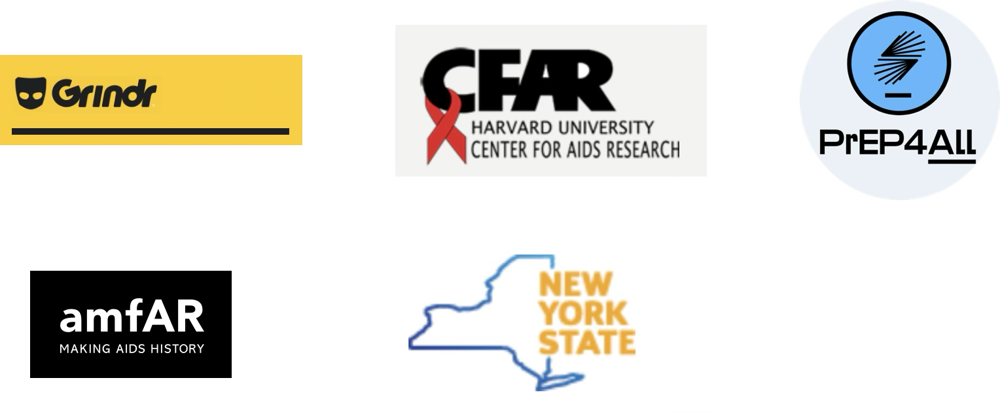

```{r update_mpxnyc_package}
#pat  <- tidyjson::read_json("_config.json")[["..JSON"]][[1]][["settings"]][["github-token"]] # update packages
#remotes::install_github("KeletsoMakofane/mpxnyc", auth_token = pat)

remotes::install_github("KeletsoMakofane/mpxtools")

```

```{r other_packages}
#install.packages(c("labelled", "tidygraph", "dplyr", "here", "ggimage", "rsvg", "ggraph", "ggplot2", "gt", "gtsummary", "latex2exp))

```

```{r process_data}
targets::tar_source("R_functions") # Access custom defined functions
targets::tar_make(reporter = "silent") # Run data pipeline
```

# Welcome {.unnumbered .hidden}

::: {.p-5 .pt-1 .mb-4 .rounded-3 .shadow-sm .hero-banner .centered layout-align="center"}
# Community and Connection {.unnumbered}

A rapid, community-led study of mpox, networks, and care—built by queer and trans New Yorkers, for queer and trans New Yorkers.

[Explore the Findings](3_results/3_1__results_participants){.btn .btn-outline-primary .m-1 .btn-sm} [Learn the Methods](a_ssnac1_context/a__ssnac1_context){.btn .btn-outline-primary .m-1 .btn-sm} [Meet the Team](e_mpxnyc_organizing/e__mpxnyc_organizing){.btn .btn-outline-primary .m-1 .btn-sm}
:::

# Welcome

This book presents the **MPX NYC** study, an anonymous, web-based research project that maps how LGBTQ+ people and places are connected across the city. Using a survey platform we whipped up from scratch, we asked participants to show us where in New York they hanged out (both 🪩🕺, and 😈💦) in the preceding four weeks. We captured only the census tract labels for those places and used those to make a giant network of people and census tracts. This book presents what we learn from analyzing that network. 

Along with the study results, we provide all the code that generated the book as well as a detailed set of appendices for students, activists, and researchers who wish to learn or use these methods. We introduce a new framework for causal inference in epidemiology called **SSNAC**. SSNAC guides the collection, management, analysis, and causal interpretation of data from complex causal systems. We release the survey instrument we developed -- the **MPX NYC person-place network mapper**.  

The work was conducted under **RESPND-MI** (Rapid Epidemiologic Study of Sexual Networks, Demography, and Mpox Infection), a community-led collaboration formed during the 2022 mpox outbreak among queer and trans New Yorkers. It convened activists, organizers, and researchers to share information quickly and act. 

MPX NYC mapped the social and spatial connections of queer and trans New Yorkers to inform the mpox response. What we found affirms joy, connection, and offers new insights into the structure of the LGBTQ+ community in New York City.


# At a glance {.unnumbered}


::::::::::::::: {.grid .g-6 .mt-1}
:::: {.g-col-12 .g-col-md-6 .g-col-xl-6}
::: {.card .h-100 .shadow-sm}
[FINDINGS]{.emphasize}

Participants’ residences and gatherings cluster in Manhattan and North Brooklyn; mixing shows strong homophily by race–gender and orientation; simulated strategies trade off rapid coverage vs. faster network fragmentation.

[People](3_results/3_1__results_participants){.btn .btn-sm .btn-outline-secondary} [Gatherings](3_results/3_3__results_movement){.btn .btn-sm .btn-outline-secondary} 
[Going out](3_results/3_5__results_outbreak_control){.btn .btn-sm .btn-outline-secondary}
[Mixing](3_results/3_5__results_outbreak_control){.btn .btn-sm .btn-outline-secondary}
[Outbreaks](3_results/3_5__results_outbreak_control){.btn .btn-sm .btn-outline-secondary}
:::
::::

:::: {.g-col-12 .g-col-md-6 .g-col-xl-6}
::: {.card .h-100 .shadow-sm}
[SSNAC FRAMEWORK]{.emphasize}

SSNAC extends causal inference to people–place networks. We pair it with an anonymous, bilingual survey and a custom Person–Place Network Mapper.

[Context](a_ssnac1_context/a__ssnac1_context){.btn .btn-sm .btn-outline-secondary} 
[Description](b_ssnac2_description/b__ssnac2_description){.btn .btn-sm .btn-outline-secondary} 
[Causality](c_ssnac3_causality/c__ssnac3_causality){.btn .btn-sm .btn-outline-secondary}
[Measurement](b_ssnac2_description/b__ssnac2_description){.btn .btn-sm .btn-outline-secondary} 

:::
::::

:::: {.g-col-12 .g-col-md-6 .g-col-xl-6}
::: {.card .h-100 .shadow-sm}
[MEASUREMENT & TOOLS]{.emphasize}

How we safely collected spatial and network data: on-device coarsening to census tracts, anonymous link tracing, and a Neo4j backend.

[Data](d_ssnac4_measurement/d__ssnac4_measurement){.btn .btn-sm .btn-outline-secondary} 
[Measurement](2_methods/2_2_methods_data){.btn .btn-sm .btn-outline-secondary} 

:::
::::

:::: {.g-col-12 .g-col-md-6 .g-col-xl-6}
::: {.card .h-100 .shadow-sm}
[COMMUNITY ORGANIZING]{.emphasize}

Weekly LGBTQ+ Community Forum, distributed leadership, and small, shared tasks by design—redundancy as resilience.

[Organizing](f_organizing/f__organizing){.btn .btn-sm .btn-outline-secondary} 
[Marketing](e_marketing_comm/e__marketing_comm){.btn .btn-sm .btn-outline-secondary}
:::
::::


:::::::::::::::

# Why this work matters {.unnumbered}

As public support for LGBTQ+ health declines, this project shows that **rigorous epidemiology and community organizing can coexist**. Through the weekly **RESPND-MI LGBTQ+ Community Forum**, activists, clinicians, and researchers co-designed the study—refining language to avoid stigma, choosing outreach venues, and building bilingual campaigns.

The project became not only a study *of* networks, but a network *itself*: a model of participatory, queer-led science built from abundance, care, and trust.

# Who we are {.unnumbered}

**Lead author:** Keletso Makofane, MPH, PhD\
**Co-authors:** Nicholas Diamond, MPH; Jennifer Barnes-Balenciaga; Elle Lett, MA, MBiostat, PhD; Ken Mayer, MD; Nguyen Tran, MPH, PhD

[Full team & partners →](f_organizing/f__organizing#who-we-are)

# Open science {.unnumbered}

All code and analytic frameworks developed for this project—including the code that powers this site—are publicly available. We hope these methods can be adapted by **alliances of LGBTQ+ researchers and activists** to answer urgent questions on housing, care, and health.

[Access code & resources →](d_ssnac4_measurement/d__ssnac4_measurement)

```{r}
#| fig-width: 2
#| fig-height: 2
#| fig-align: center


plot_icon(icon_name = "peach", color = "dark_orange", shape = 0)

```

::: {#acknowledgements}
**RESPND-MI** [Principal investigator]{.underline}: Keletso Makofane, MPH, PhD. [Co-investigators]{.underline}: Jennifer Barnes-Balenciaga, Nicholas Diamond, MPH, Elle Lett, PhD, MA, MBiostat, Cody Nolan, MD, Martez Smith, LMSW, PhD, Nguyen Tran, MPH, PhD. [Former investigators]{.underline}: Pedro Botti Careneiro, MPH, PhD, Seema Kara, MPH, James Krellenstein, Ken Nadolski, MPH, Joseph Osmundson, PhD, Robert Pitts, MD, Grant Roth, MPH, Sudipta Saha, MS, Christian Urrutia, MBA, Chris Wyman. [Translator]{.underline}: Antón Castellanos Usigli, MPH, DrPH. [Reference group]{.underline}: Judith D. Auerbach, PhD (*University of California, San Francisco*), Lisa Berkman, PhD (*Harvard University*), Forrest W. Crawford, PhD (*Yale University*), William C. Goedel, PhD (*Brown University*), Gregg Gonsalves, PhD (*Yale University*), Ian W. Holloway, PhD, LCSW, MPH (*University of California, Los Angeles*), Louise Ivers, MB, BCh, MD, MPH, DTMH (*Massachusetts General Hospital*), Lawrence C. Long, MCom, PhD (*Boston University)*, Kenneth Mayer, MD (*The Fenway Institute*), Gregorio Millett, MPH (*amfAR*), Eric J. Tchetgen Tchetgen, PhD (*University of Pennsylvania*). [Research sponsors and funders]{.underline}: amfAR; Harvard Center for AIDS Research; National Institutes of Health; neo4j, New York State Department of Health. [Marketing sponsors and funders]{.underline}: Grindr; Hub for Health Intervention, UCLA Luskin School of Public Affairs. [Administration]{.underline}: Christian Urrutia, MBA (PrEP4All); James Krellenstein (PrEP4All).

**OPEN SCIENCE** All the code we developed as a part of this project, including the code for this website, will be publicly available. Our hope is that alliances of LGBTQ+ activists and researchers will use these methods to answer the pressing questions of their communities: housing, nutrition, violence, access to care, employment, health, and others. As government support for LGBTQ+ health diminishes, we will need to take it upon ourselves to conduct research and surveillance and use what we learn to respond to the needs of our communities. We include in this report a brief account of the steps we implemented to coordinate the volunteer work of over a dozen activists, academics, and community leaders.

**CONTACT** Keletso Makofane (keletso\@controlf.info). Nicholas Diamond (nick\@controlf.info). [Ctrl+F](https://www.controlf.info){target="_blank"}.

**SUGGESTED CITATION** Makofane, K., Diamond, N., Barnes-Balenciaga, J., Lett, E., Mayer, K., Tran, N. (2025). *Community and connection: A study on social connection among LGBTQ+ New Yorkers*. Ctrl+F on behalf of RESPND-MI. New York City. Available: https://mpxresponse.org

**ACKNOWLEDGEMENTS** We thank PrEP4All for generously providing administrative support, and we thank our many individual donors who contributed funds (and encouragement) to the project; Eric Tchetgen Tchetgen, who nurtured this work; members of the RESPND-MI Community Forum and Reference Group for their thoughtful suggestions on matters ranging from fundraising strategy to study design; and all the individual LGBTQ people who dedicated time and energy towards taking care of our community at a time of crisis. We dedicate this work to those who responded to the crisis, and to those who will respond to the crises to come.
:::

{fig-align="center" width="469"}

::: {.emphasize}

-   "Access codes & resources" link is broken on the front page

-   "Full team & partners" link takes you to the wrong place, but I think we can delete this anyways because below we have everyone's names (I have another similar comment about this below)

-   Should we add logos for NIH, neo4j, and Hub for Health Intervention?

-   I don't know what Hub for Health Intervention is, and I don't remember NIH supporting the work.

-   Capitalize "Neo4j"

-   Consider changing to: "We hope these methods can be adapted by alliances of LGBTQ+ researchers and activists to answer urgent questions on housing, nutrition, violence, access to care, employment, and health."

-   Remove comma after crisis: "We dedicate this work to those who responded to the crisis and to those who will respond to the crises to come.

:::
